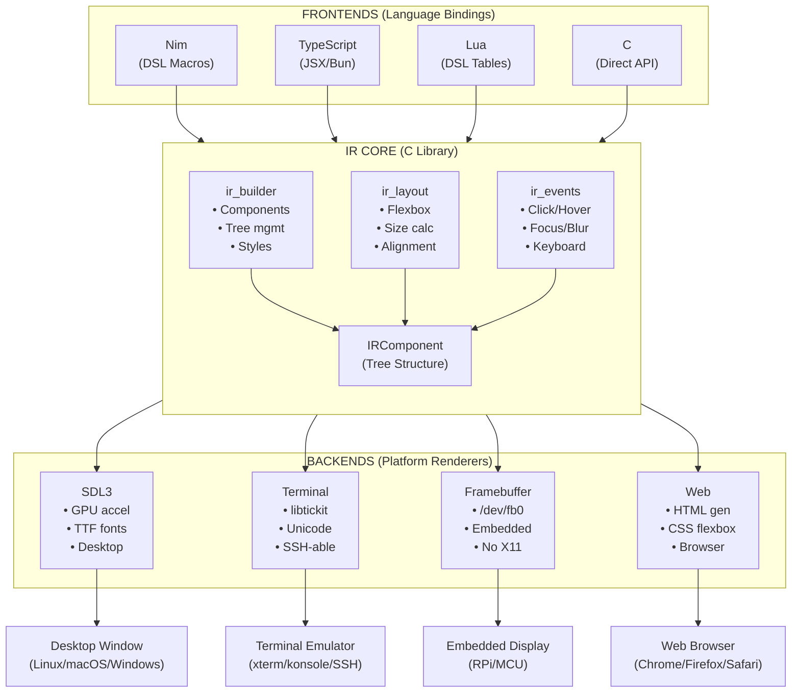
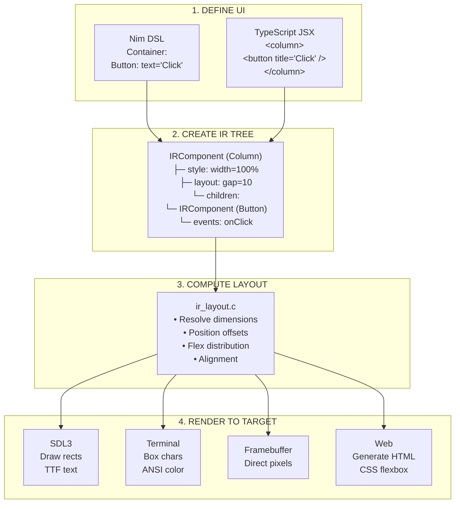
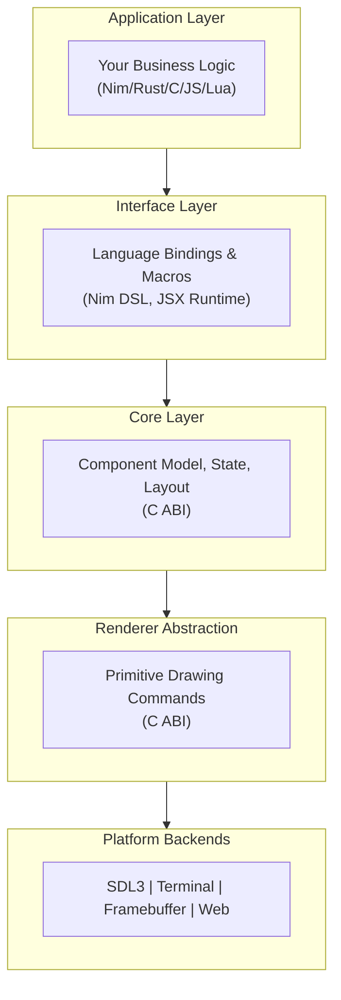
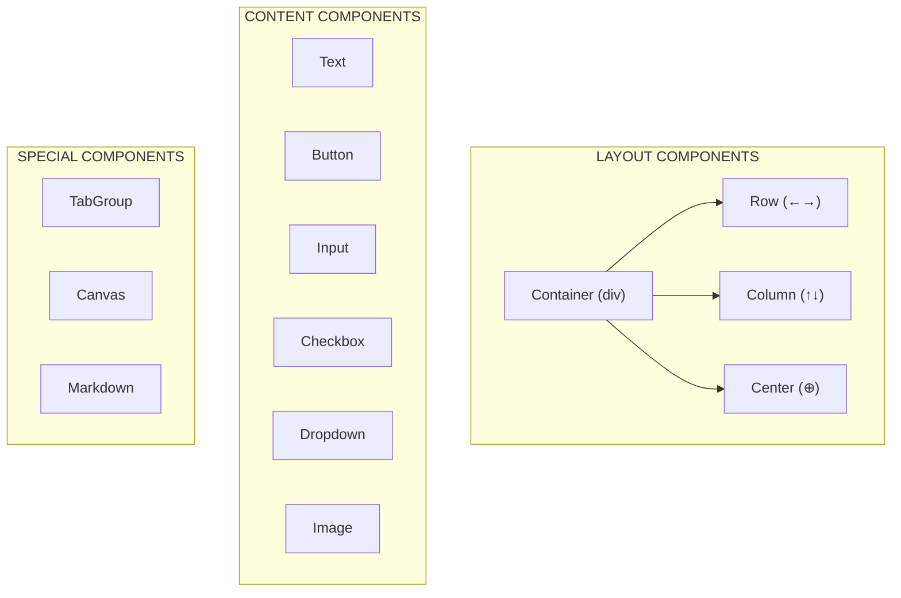
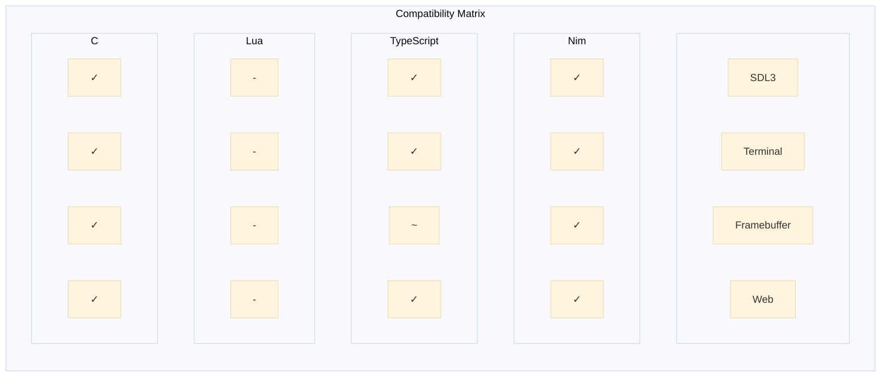
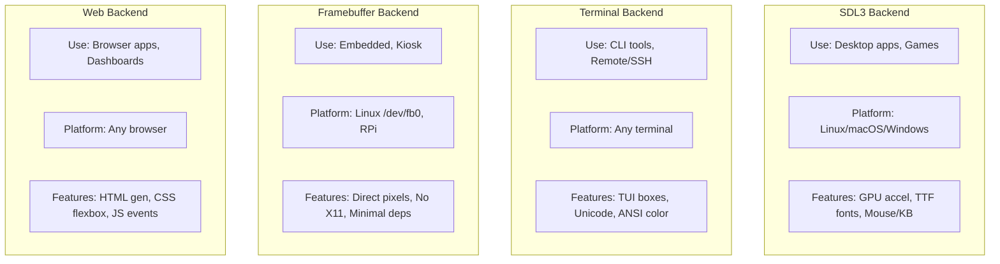

# Kryon Architecture

## Overview

Kryon is a multi-platform UI framework designed with a clean separation between the core logic, rendering backends, and language frontends.

### Core Philosophy
*   **Minimal surfaces, maximal flexibility.**
*   **Hardware-aware abstractions.**
*   **Declarative UI in your application language.**

## Pipeline Diagram



## Data Flow



## System Architecture

### Layered Onion Model



### Critical Boundary

The **Core Layer** and **Renderer Abstraction** expose a pure C ABI. This allows:
*   Microcontrollers to link directly to the C core.
*   Desktop apps to use high-level bindings.
*   Web apps to compile to WASM.

## Component Types



## Directory Structure

```
kryon/
├── ir/                          # IR Core (C)
│   ├── ir_core.h               # Component types, structs
│   ├── ir_builder.c            # Tree construction
│   ├── ir_layout.c             # Flexbox layout
│   └── ir_events.c             # Event handling
│
├── backends/
│   ├── desktop/                # Desktop backends
│   │   ├── sdl_backend.c       # SDL3 rendering
│   │   └── ir_desktop_renderer.c
│   └── web/                    # Web backend
│       ├── html_generator.c    # HTML output
│       ├── css_generator.c     # CSS output
│       └── ir_web_renderer.c
│
├── bindings/
│   ├── nim/                    # Nim frontend
│   │   ├── kryon_dsl.nim       # DSL macros
│   │   ├── runtime.nim         # Event handlers
│   │   └── reactive_system.nim # State management
│   └── typescript/             # TypeScript frontend
│       └── src/
│           ├── jsx-runtime.ts  # JSX transform
│           ├── renderer.ts     # IRNode → C IR
│           ├── ffi.ts          # Bun FFI bindings
│           └── app.ts          # Entry point
│
├── examples/
│   ├── nim/                    # Nim examples
│   │   ├── hello_world.nim
│   │   ├── button_demo.nim
│   │   └── ...
│   └── typescript/             # TypeScript examples
│       ├── hello_world.tsx
│       ├── button_demo.tsx
│       └── ...
│
└── build/                      # Compiled libraries
    ├── libkryon_ir.a
    ├── libkryon_desktop.so
    └── libkryon_web.so
```

## Running Examples

```bash
# Nim + SDL3 (default)
./run_example.sh hello_world
./run_example.sh hello_world nim sdl3

# Nim + Terminal
./run_example.sh hello_world nim terminal

# TypeScript + SDL3
./run_example.sh hello_world ts
./run_example.sh hello_world typescript sdl3

# TypeScript + Web (generates HTML, starts server)
./run_example.sh hello_world ts web

# By number (from example list)
./run_example.sh 22   # hello_world typescript
```

## Core Layer (C99 ABI)

The core layer handles:
*   Component tree lifecycle.
*   Unified event system.
*   Flexbox-inspired layout engine.
*   Style resolution.
*   Storage API.

It guarantees:
*   **No global state.**
*   **Deterministic layout.**
*   **No hidden allocations.**
*   **Fixed-point math** for MCU compatibility.

## Renderer Abstraction

All backends must implement a minimal set of primitive commands:
*   `draw_rect`
*   `draw_text`
*   `draw_line`
*   `swap_buffers`

## Frontend × Backend Matrix



| Frontend   | SDL3 | Terminal | Framebuffer | Web |
|------------|:----:|:--------:|:-----------:|:---:|
| Nim        |  ✓   |    ✓     |      ✓      |  ✓  |
| TypeScript |  ✓   |    ✓     |      ~      |  ✓  |
| Lua        |  -   |    -     |      -      |  -  |
| C          |  ✓   |    ✓     |      ✓      |  ✓  |

**Legend:** ✓ = Supported, ~ = Partial, - = Planned

## Backend Comparison



| Backend     | Use Case                | Platform              | Key Features                        |
|-------------|-------------------------|-----------------------|-------------------------------------|
| SDL3        | Desktop apps, Games     | Linux/macOS/Windows   | GPU accel, TTF fonts, Mouse/KB      |
| Terminal    | CLI tools, Remote/SSH   | Any terminal          | TUI boxes, Unicode, ANSI color      |
| Framebuffer | Embedded, Kiosk         | Linux /dev/fb0, RPi   | Direct pixels, No X11, Minimal deps |
| Web         | Browser apps, Dashboards| Any browser           | HTML gen, CSS flexbox, JS events    |

## Frontend Overview

| Frontend   | Syntax                | Runtime         | Best For                      |
|------------|----------------------|-----------------|-------------------------------|
| Nim        | DSL macros           | Compiled native | Performance, Desktop, Embedded|
| TypeScript | JSX syntax           | Bun + FFI       | Web devs, Rapid prototyping   |
| Lua        | Table-based (planned)| Lua VM          | Scripting, Hot-reload, Modding|
| C          | Direct API calls     | Compiled native | Max control, Library integration |

## Quick Reference

```bash
# List all examples
./run_example.sh

# Frontend options: nim, ts (typescript), lua, c
# Backend options: sdl3, terminal, framebuffer, web

# Examples:
./run_example.sh hello_world              # nim + sdl3 (default)
./run_example.sh hello_world nim sdl3     # nim + sdl3 (explicit)
./run_example.sh hello_world nim terminal # nim + terminal
./run_example.sh hello_world ts           # typescript + sdl3
./run_example.sh hello_world ts web       # typescript + web (serves HTML)
./run_example.sh hello_world ts terminal  # typescript + terminal
```
