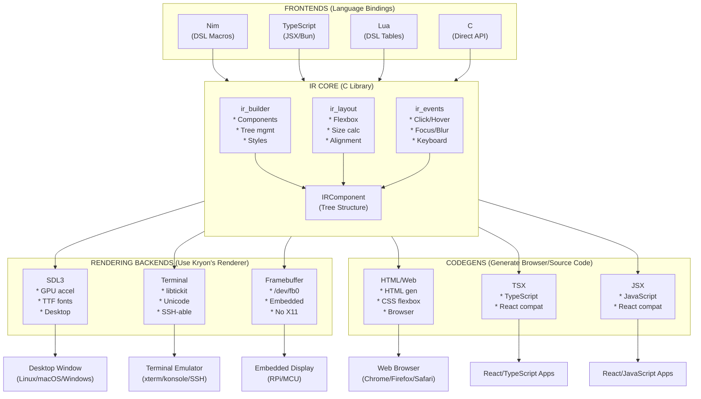
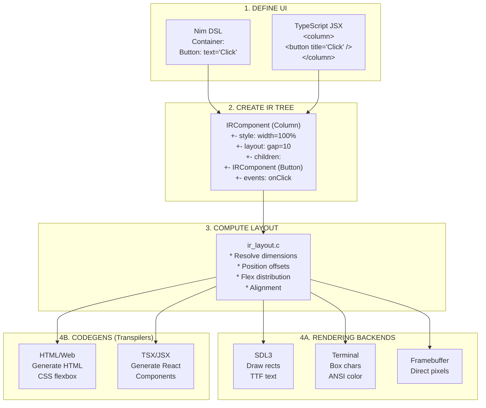
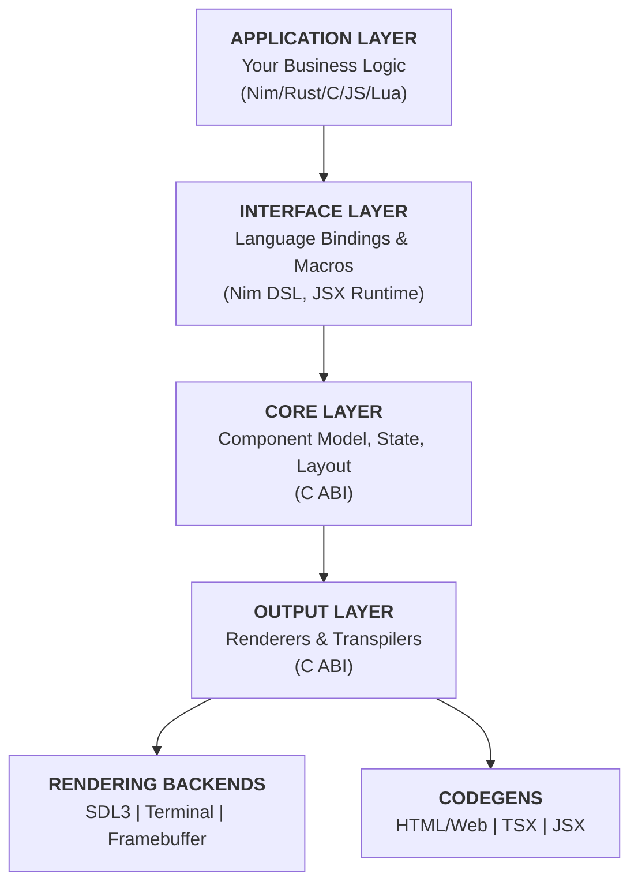
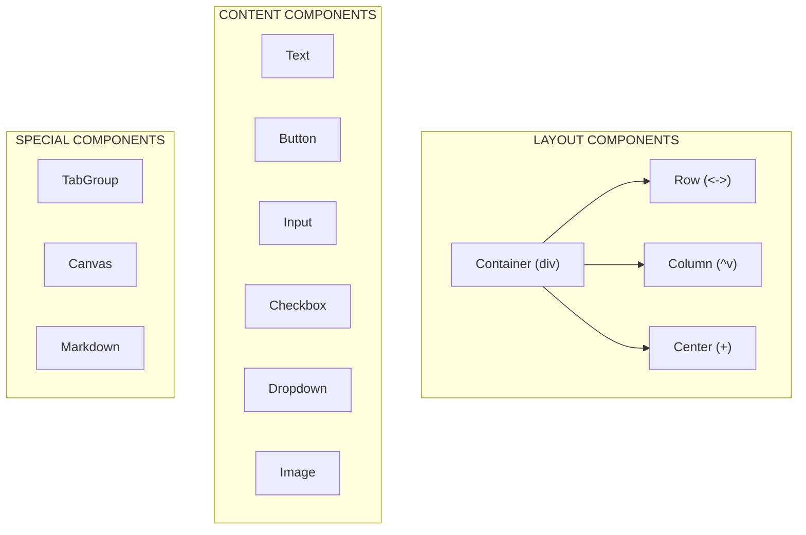

# Kryon Architecture

## Overview

Kryon is a multi-platform UI framework designed with a clean separation between language bindings, the IR core, rendering backends, and transpilation targets.

### Core Philosophy
*   **Minimal surfaces, maximal flexibility.**
*   **Hardware-aware abstractions.**
*   **Declarative UI in your application language.**

### Architecture Layers

**Language Bindings** → **KIR Pipeline** → **Rendering Backends + Codegens**

- **Rendering Backends** (SDL3, Terminal): Use Kryon's renderer to draw UI directly
- **Codegens/Transpilers** (HTML/Web, TSX, JSX): Generate code that browsers/tools render

## File Formats

Kryon uses two runtime file formats:

- **.kir** - JSON intermediate representation (human-readable, for development and debugging)
- **.krb** - Standalone binary package (like .love files), portable across all renderers

**Native Targets** (Nim, C, Rust) compile directly to native code that generates IR at runtime.

**VM Targets** (Lua, JavaScript/TypeScript, Python, .kry) compile to `.krb` packages that run in any Kryon renderer.

## Pipeline Diagram



## Data Flow



## System Architecture

### Layered Onion Model



### Critical Boundary

The **Core Layer** and **Renderer Abstraction** expose a pure C ABI. This allows:
*   Microcontrollers to link directly to the C core.
*   Desktop apps to use high-level bindings.
*   Web apps to compile to WASM.

## Component Types



## Directory Structure

```
kryon/
+-- ir/                          # IR Core (C)
|   +-- ir_core.h               # Component types, structs
|   +-- ir_builder.c            # Tree construction
|   +-- ir_layout.c             # Flexbox layout
|   +-- ir_events.c             # Event handling
|
+-- backends/
|   +-- desktop/                # Desktop rendering backend
|       +-- sdl_backend.c       # SDL3 rendering
|       +-- ir_desktop_renderer.c
|
+-- codegens/
|   +-- web/                    # HTML/Web transpiler
|       +-- html_generator.c    # HTML output
|       +-- css_generator.c     # CSS output
|       +-- ir_web_renderer.c
|
+-- bindings/
|   +-- nim/                    # Nim frontend
|   |   +-- kryon_dsl.nim       # DSL macros
|   |   +-- runtime.nim         # Event handlers
|   |   +-- reactive_system.nim # State management
|   +-- typescript/             # TypeScript frontend
|       +-- src/
|           +-- jsx-runtime.ts  # JSX transform
|           +-- renderer.ts     # IRNode -> C IR
|           +-- ffi.ts          # Bun FFI bindings
|           +-- app.ts          # Entry point
|
+-- examples/
|   +-- nim/                    # Nim examples
|   |   +-- hello_world.nim
|   |   +-- button_demo.nim
|   |   +-- ...
|   +-- typescript/             # TypeScript examples
|       +-- hello_world.tsx
|       +-- button_demo.tsx
|       +-- ...
|
+-- build/                      # Compiled libraries
    +-- libkryon_ir.a           # Core IR library
    +-- libkryon_desktop.so     # SDL3 rendering backend
    +-- libkryon_web.so         # HTML/Web codegen
```

## Running Examples

```bash
# Nim + SDL3 (default)
./run_example.sh hello_world
./run_example.sh hello_world nim sdl3

# Nim + Terminal
./run_example.sh hello_world nim terminal

# TypeScript + SDL3
./run_example.sh hello_world ts
./run_example.sh hello_world typescript sdl3

# TypeScript + HTML/Web codegen (transpiles to HTML, starts server)
./run_example.sh hello_world ts web

# By number (from example list)
./run_example.sh 22   # hello_world typescript
```

## Core Layer (C99 ABI)

The core layer handles:
*   Component tree lifecycle.
*   Unified event system.
*   Flexbox-inspired layout engine.
*   Style resolution.
*   Storage API.

It guarantees:
*   **No global state.**
*   **Deterministic layout.**
*   **No hidden allocations.**
*   **Fixed-point math** for MCU compatibility.

## Renderer Abstraction

All backends must implement a minimal set of primitive commands:
*   `draw_rect`
*   `draw_text`
*   `draw_line`
*   `swap_buffers`

## Language Binding Compatibility

### Rendering Backends

| Binding    | SDL3 | Terminal | Framebuffer |
|------------|:----:|:--------:|:-----------:|
| Nim        | [x]  |   [x]    |     [x]     |
| TypeScript | [x]  |   [x]    |     [~]     |
| Lua        |  -   |    -     |      -      |
| C          | [x]  |   [x]    |     [x]     |

### Codegens (Transpilers)

| Binding    | HTML/Web | TSX | JSX |
|------------|:--------:|:---:|:---:|
| Nim        |   [x]    | [-] | [-] |
| TypeScript |   [x]    | [-] | [-] |
| Lua        |    -     |  -  |  -  |
| C          |   [x]    | [-] | [-] |

**Legend:** [x] = Supported, [~] = Partial, - = Planned, [-] = Not applicable

## Rendering Backends

| Backend     | Use Case                | Platform              | Key Features                        |
|-------------|-------------------------|-----------------------|-------------------------------------|
| SDL3        | Desktop apps, Games     | Linux/macOS/Windows   | GPU accel, TTF fonts, Mouse/KB      |
| Terminal    | CLI tools, Remote/SSH   | Any terminal          | TUI boxes, Unicode, ANSI color      |
| Framebuffer | Embedded, Kiosk         | Linux /dev/fb0, RPi   | Direct pixels, No X11, Minimal deps |

## Codegens (Transpilers)

| Codegen     | Output Format           | Use Case              | Key Features                        |
|-------------|-------------------------|-----------------------|-------------------------------------|
| HTML/Web    | HTML/CSS/JS files       | Browser apps, Sites   | CSS flexbox, DOM events, Static gen |
| TSX         | TypeScript/React code   | React apps            | Component transpilation, Type-safe  |
| JSX         | JavaScript/React code   | React apps            | Component transpilation             |

## Frontend Overview

| Frontend   | Syntax                | Runtime         | Best For                      |
|------------|----------------------|-----------------|-------------------------------|
| Nim        | DSL macros           | Compiled native | Performance, Desktop, Embedded|
| TypeScript | JSX syntax           | Bun + FFI       | Web devs, Rapid prototyping   |
| Lua        | Table-based (planned)| Lua VM          | Scripting, Hot-reload, Modding|
| C          | Direct API calls     | Compiled native | Max control, Library integration |

## Quick Reference

```bash
# List all examples
./run_example.sh

# Language binding options: nim, ts (typescript), lua, c
# Rendering backend options: sdl3, terminal, framebuffer
# Codegen options: web (HTML/CSS/JS transpiler)

# Examples:
./run_example.sh hello_world              # nim + sdl3 (default)
./run_example.sh hello_world nim sdl3     # nim + sdl3 (explicit)
./run_example.sh hello_world nim terminal # nim + terminal rendering
./run_example.sh hello_world ts           # typescript + sdl3
./run_example.sh hello_world ts web       # typescript + HTML codegen (transpiles to browser)
./run_example.sh hello_world ts terminal  # typescript + terminal rendering
```
