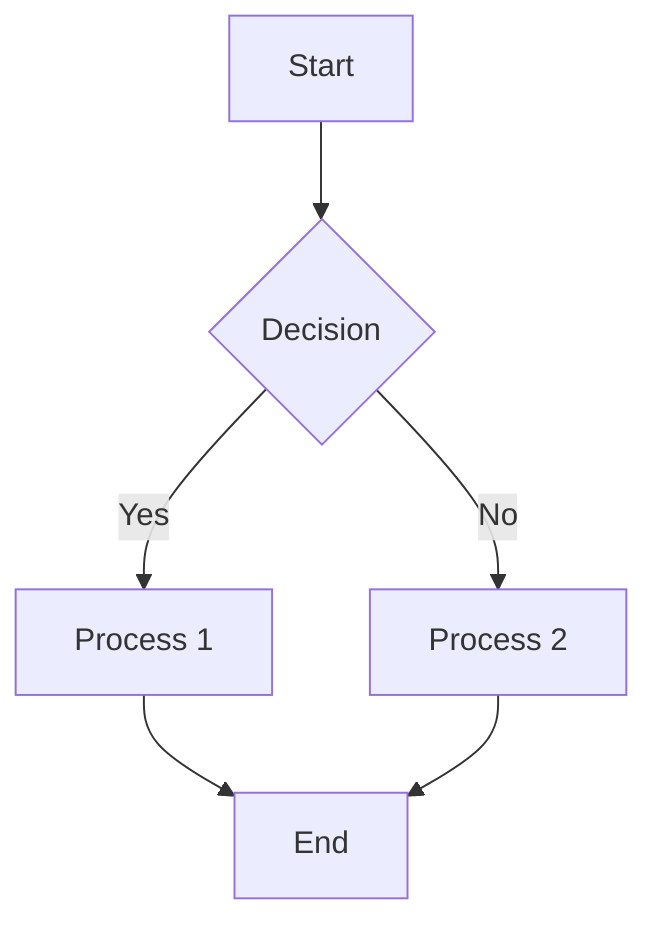

# Mermaid Test

This page tests mermaid diagram rendering.

## Simple Flowchart

```mermaid
flowchart TB
    A[Start] --> B{Decision}
    B -->|Yes| C[Process 1]
    B -->|No| D[Process 2]
    C --> E[End]
    D --> E
```

## Another Diagram

```mermaid
flowchart LR
    A[Client] --> B[Server]
    B --> C[Database]
    C --> B
    B --> A
```
